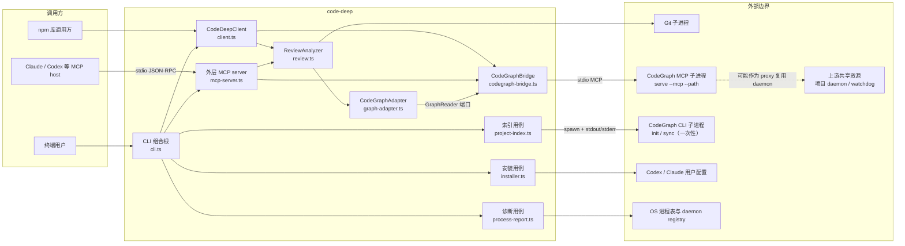
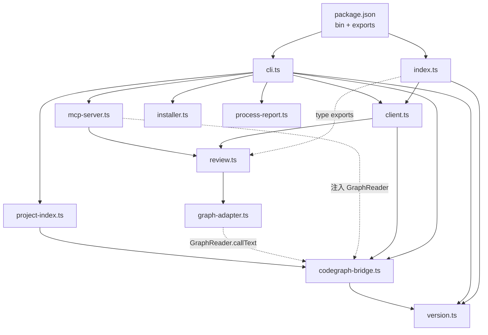
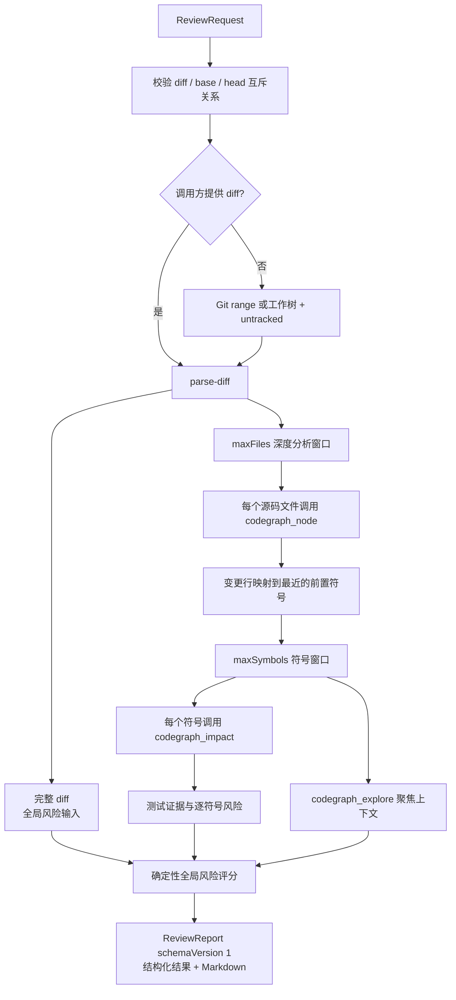

# code-deep 架构

`@team-harness/code-deep` 是 CodeGraph 之上的持久化代码智能与审查桥。它负责三类调用入口、MCP/子进程生命周期、Git diff 审查编排、上游文本结果的标准化，以及安装和诊断工具；索引构建、符号检索和影响分析本身由固定版本的 `@colbymchenry/codegraph` 提供。

本文描述当前实现，而不是未来设计。源码入口以 [`package.json`](package.json)、[`src/cli.ts`](src/cli.ts) 和 [`src/index.ts`](src/index.ts) 为准。

## 系统上下文



系统存在两个 stdio JSON-RPC 协议边界：MCP host 到外层 code-deep server，以及 `CodeGraphBridge` 到内层 `serve --mcp` 子进程。`init`/`sync` 是另一条普通 CLI 子进程路径：它只收集 stdout/stderr，进程退出即完成，不复用 bridge 的 MCP 会话。

`CodeGraphBridge` 拥有它直接派生的 `serve --mcp` 会话及 transport；`close()` 关闭 client/transport，并结束这个直接子进程。即使进程诊断因同项目存在 live daemon 而把该子进程标成 `codegraph-proxy`，直接会话的关闭责任也不转移。上游共享的项目 daemon 和 watchdog 则不由 code-deep 创建或清理，`ps` 只观察它们。

## 公共入口

| 入口 | 当前公开能力 | 项目路径与生命周期 |
| --- | --- | --- |
| CLI [`src/cli.ts`](src/cli.ts) | `install`、`ps`/`processes`、`mcp`、`init`、`explore`、`review` | `explore` 和 `review` 每次创建一个 `CodeDeepClient`，并在 `finally` 中关闭；`mcp` 保持 bridge 常驻，收到 server close、`SIGINT` 或 `SIGTERM` 时关闭 |
| MCP [`src/mcp-server.ts`](src/mcp-server.ts) | 只公开 `explore` 和 `review`；两者标记为只读、幂等 | server 有默认 `projectPath`，每次工具调用可覆盖；工具异常转换为 MCP `isError` 结果 |
| npm 库 [`src/index.ts`](src/index.ts) | `CodeDeepClient`、版本常量和 review 数据类型 | `projectPath` 在构造时固定；调用方负责执行 `close()` |

`CodeGraphBridge`、`ReviewAnalyzer`、`CodeGraphAdapter` 和 MCP server 工厂都不是根包的运行时公共 API。这个边界由 [`tests/client.test.ts`](tests/client.test.ts) 固化，避免调用方依赖内部传输与解析实现。

## 模块与依赖方向



依赖总体从入口层流向编排层，再流向端口、适配器和外部进程。唯一明显的旁路交叉依赖是 [`src/project-index.ts`](src/project-index.ts) 为复用随包 CodeGraph 二进制定位逻辑而导入 [`resolveCodeGraphBin`](src/codegraph-bridge.ts)。

| 模块 | 责任与边界 |
| --- | --- |
| [`src/cli.ts`](src/cli.ts) | 唯一可执行组合根；注册命令、解析参数、选择文本或 JSON 输出，并拥有 CLI 资源关闭逻辑 |
| [`src/index.ts`](src/index.ts) | 稳定的 npm 导出面；隐藏内部 bridge、adapter、analyzer 和 server 实现 |
| [`src/client.ts`](src/client.ts) | 公共 facade；让 `explore` 与 `review` 共享同一个持久 bridge，并统一项目路径和关闭入口 |
| [`src/codegraph-bridge.ts`](src/codegraph-bridge.ts) | CodeGraph MCP 子进程边界；解析随包二进制、懒连接、复用连接、单次重连、校验 MCP 结果 |
| [`src/graph-adapter.ts`](src/graph-adapter.ts) | 定义 `GraphReader` 端口；把 CodeGraph 的人类可读文本标准化成带版本、置信度、warning 和原文的结构 |
| [`src/mcp-server.ts`](src/mcp-server.ts) | 外层 MCP 协议适配器；Zod 输入校验、工具元数据、review 输出 schema 和错误封装 |
| [`src/review.ts`](src/review.ts) | 核心 review application service；获取和解析 diff、映射符号、查询影响、关联测试、计算风险并渲染报告 |
| [`src/project-index.ts`](src/project-index.ts) | 显式索引生命周期；通过独立 `CodeGraphCommandRunner` 在当前 Git 仓库边界内执行一次性 CodeGraph `init` 或 `sync` 子进程 |
| [`src/installer.ts`](src/installer.ts) | 向 Codex/Claude 用户配置安装 MCP 入口和 agent 指令；保留无关配置并进行备份和原子替换 |
| [`src/process-report.ts`](src/process-report.ts) | 只读进程诊断；合并 OS 进程表和 CodeGraph daemon registry，输出带版本的健康报告 |
| [`src/version.ts`](src/version.ts) | 从本包 `package.json` 分别导出 wrapper 版本和 CodeGraph 依赖版本 |

## 主要执行流

### 索引初始化与刷新

`code-deep init [path]` 是显式索引入口；首次 `explore` 或 `review` 也会在 Git 仓库中自动创建缺失的 `.codegraph`，后续调用复用已有索引。

1. [`initializeProjectIndex`](src/project-index.ts) 从请求路径向上查找 `.git`，将最近的 Git 边界作为仓库根；worktree 中的 `.git` 文件同样有效。
2. 它继续向上查找已有的 `.codegraph` 目录，但不会越过仓库根，因此不会误用相邻或父仓库的索引。
3. 已有索引执行 CodeGraph `sync <root> --quiet`；没有索引时执行 `init <root>`。
4. 默认 runner 以 `node <codegraph-bin> ...args` 派生一次性 CLI 子进程，并收集 stdout/stderr；它不经过 `CodeGraphBridge` 或 `serve --mcp` 连接。
5. 子进程非零退出或收到信号时失败；错误输出会重新标记为 code-deep 命令语义后再抛出。

索引内容由 CodeGraph 写入 `<root>/.codegraph`。code-deep 只决定目标根和动作，不解释索引内部格式。

### Explore

CLI、MCP 和 npm 库最终都调用 `codegraph_explore`：

1. CLI/npm 路径经过 [`CodeDeepClient.explore`](src/client.ts)；MCP handler 在 [`src/mcp-server.ts`](src/mcp-server.ts) 中直接使用注入的 `GraphReader`。
2. [`CodeGraphBridge.callText`](src/codegraph-bridge.ts) 通过持久 stdio 连接调用内层 CodeGraph。
3. 返回值保持为原始文本。Explore 不经过 `CodeGraphAdapter`，因此不能被描述为结构化结果。

CLI/npm client 的项目路径在 client 构造时固定；MCP 工具还允许每次调用覆盖 `projectPath`。

### Review



[`ReviewAnalyzer.analyze`](src/review.ts) 的关键不变量如下：

- `diff` 与 `base`/`head` 互斥，`head` 必须配合 `base`；校验发生在任何图调用之前。
- 未提供 diff 时，range 模式使用三点 Git diff；工作树模式合并 `HEAD` diff 和未跟踪文件。仓库尚无首个 commit 时也能审查未跟踪文件。
- 隐式工作树采集会排除 code-deep 自动初始化生成的 `.codegraph/.gitignore`，并通过 `ignoredPaths` 显式记录；caller-supplied diff 和 range 不应用该过滤。
- `maxFiles` 和 `maxSymbols` 只限制昂贵的图分析。全局风险始终基于完整 diff，报告通过 `filesOmitted` 和 `symbolsOmitted` 显式暴露截断。
- 变更行映射到同文件中最近的前置符号；`mappingConfidence` 表达这种启发式映射的可靠度。
- `CodeGraphAdapter` 分别调用 `codegraph_node`、`codegraph_impact` 和 `codegraph_explore`。影响结果中的测试文件用于生成 `linked`、`changed`、`missing` 或 `unknown` 测试状态。
- review item 按风险降序排列；整体分数取全局信号总分与最高 review item 分数的较大值，避免局部高风险被较低的聚合分数掩盖。逐符号风险只在 impact 解析为 `high` 且符号映射不为 `low` 时加入 `cross-boundary-impact`：边界保守识别为 workspace root 下的 package/app/service/module/lib，或 `src/` 下第一层领域。当前后端没有结构化关键流程证据，因此不从展示文本推断 `critical-flow`。
- 同一个核心 `ReviewReport` 同时承载版本化结构与由该结构渲染的 Markdown；CLI 通过 `--json` 选择输出。MCP 投影使用独立的 `schemaVersion: 2`，按 `detailLevel` 投影该报告：默认 `minimal` 只返回摘要、风险信号、紧凑行范围和前三个 review item，并通过 `reviewItemsOmitted` 显式报告响应层截断；显式 `standard` 才返回完整的有界 Diff、影响兼容视图与图上下文。

### 安装与进程诊断

这两个 CLI 用例不经过 `CodeDeepClient` 或 review 主链：

- [`installCodeDeep`](src/installer.ts) 支持 Codex 和 Claude。它以结构化 TOML/JSON 校验目标配置，用标记块维护 agent 指令，保留无关内容；修改既有文件时创建 `.code-deep.bak`，通过同目录临时文件和 rename 完成原子替换。
- [`collectProcessReport`](src/process-report.ts) 并行读取 OS 进程表、`~/.codegraph/daemons/*.json`，并在 POSIX 上用 `fs.access` 收集 socket 路径存在性；它分类 launcher、code-deep MCP、CodeGraph session/proxy/daemon/watchdog 及失效 registry 记录。路径存在不证明 socket 可连接或 daemon 存活；Windows 则从活动 daemon registry 进程推断 named-pipe 状态。输出只提供证据和 `cleanupCandidate`，不会杀进程或删除文件。

## 数据契约

### 图查询与索引命令端口

[`GraphReader`](src/graph-adapter.ts) 是 Explore/Review 图读取路径的唯一后端端口：

```ts
interface GraphReader {
  callText(name: string, args: Record<string, unknown>): Promise<string>;
}
```

生产实现由 `CodeGraphBridge` 以结构类型满足。`ReviewAnalyzer`、外层 MCP handler 和 `CodeGraphAdapter` 只依赖该读取端口，因此测试和替代查询后端无需启动真实 CodeGraph MCP 进程。

索引路径不使用 `GraphReader`，而是由 [`src/project-index.ts`](src/project-index.ts) 定义另一个进程端口：

```ts
type CodeGraphCommandRunner = (
  args: string[],
) => Promise<{ exitCode: number; stdout: string; stderr: string }>;
```

`initializeProjectIndex` 通过该端口执行 `init`/`sync`。生产默认 runner 派生一次性 CLI 子进程；测试可通过 `InitializeProjectIndexOptions.run` 注入替代实现。两个端口共享随包二进制定位函数，但不共享协议或进程生命周期。

`CodeGraphAdapter` 将文本标准化为 `schemaVersion: 1` 的三种结构：

| 结构 | 关键字段 | 退化语义 |
| --- | --- | --- |
| `GraphSymbolCatalog` | 文件、符号名/类型/行号 | 声明数量不一致或无法识别格式时降低 `confidence` 并写入 `warnings` |
| `GraphImpact` | 受影响符号、数量、测试文件 | 格式或数量不一致时保留可用部分；调用失败由 `ReviewAnalyzer` 生成低置信度替代结构 |
| `GraphContext` | 聚焦探索文本 | 当前只包装文本与置信度，不解析内部结构 |

符号和影响结构保留 `rawText`；`GraphContext` 则把上游原始响应保存在 `text`。上游格式变化时，诊断证据不会因标准化而丢失。

### ReviewReport

[`ReviewReport`](src/review.ts) 固定为 `schemaVersion: 1`，包括：

- 完整 diff 汇总、风险分数和风险级别；
- 深度分析的文件、映射符号、影响与测试证据；
- 按风险排序的 `reviewItems` 和可解释 `riskSignals`；
- `filesOmitted`、`symbolsOmitted`、置信度和 warning；
- 聚焦图上下文和自包含 Markdown。

[`src/mcp-server.ts`](src/mcp-server.ts) 维护 MCP `outputSchema` 和核心报告到协议响应的投影。MCP 不重复结构中的 Markdown，不暴露逐行数组、per-file patch 或原始 graph summary；变更行用 count + inclusive ranges 表示。改变核心报告或 MCP 投影字段时，TypeScript 类型、MCP schema、渲染器和测试必须同步更新。

### ProcessReport 与版本

[`ProcessReport`](src/process-report.ts) 同样使用 `schemaVersion: 1`。它记录生成时间、平台、进程分类、状态、项目归属、证据和只读清理候选，不表达自动清理指令。

[`src/version.ts`](src/version.ts) 从 `package.json` 分别读取 `CODE_DEEP_VERSION` 和 `CODEGRAPH_VERSION`。前者标识外层 MCP server 和 bridge client，后者表达绑定的后端依赖版本；两者有意独立演进。

## 状态与生命周期

| 状态位置 | 所有者 | code-deep 行为 |
| --- | --- | --- |
| `<root>/.codegraph` | CodeGraph | 显式 `code-deep init` 或首次 `explore`/`review` 触发创建或刷新；工作树 review 不把 code-deep 自动生成的 `.codegraph/.gitignore` 当作用户改动 |
| `~/.codegraph/daemons/*.json` | CodeGraph | `ps` 只读 registry，并与实时进程和 socket 路径存在性证据合并；不执行连接探测 |
| Codex/Claude 用户配置 | 用户，由 installer 协助维护 | `install` 执行幂等更新、备份和原子 rename |
| `codegraph.json` | 项目 | review 只读取 `extensions` 覆盖；缺失或格式错误时忽略覆盖 |
| bridge 的 `client`、`transport`、`connecting`、`closed` | 当前 Node.js 进程 | 只存在于内存，用于连接去重、失效和关闭 |

`CodeGraphBridge` 在第一次调用时懒连接，并创建直接的 `serve --mcp --path <project>` stdio 子进程；共享的 `connecting` promise 合并并发首次调用。连接关闭类错误最多触发一次失效、重建和重试，其他错误直接传播。`close()` 幂等，并同时处理已连接 client 与仍在建立中的连接。

资源所有权按入口区分：

- 单次 CLI `explore`/`review` 在 `finally` 中关闭 client；
- `mcp` 命令由外层 server close 和进程信号共同关闭 bridge，并以 guard 防止重复关闭；
- npm 库调用方必须显式调用 `CodeDeepClient.close()`；
- bridge 关闭 client/transport 时结束它直接派生的 session/proxy 子进程；
- 共享项目 daemon、watchdog 及 registry 由 CodeGraph 上游拥有，code-deep 不执行清理。

进程报告中的 POSIX socket 状态来自 `fs.access`：它只能证明路径当时存在。失效但未删除的 socket 仍可能成为 `shared` 状态证据，因此该报告不能被解释成可达性或 liveness 保证。

## 错误与降级

| 位置 | 行为 |
| --- | --- |
| MCP 输入或 handler | Zod/运行时异常被转换为带消息文本的 `isError` tool result，未知工具同样显式失败 |
| Bridge 结果 | 内层 `isError` 转为异常；缺少支持的 `content` 结构时拒绝结果；只有连接关闭类错误重试一次 |
| Git diff | Git 不可用或目标不是 worktree 时 review 整体快速失败，并保留 cause |
| 符号查询 | 单文件记录 `symbol-lookup-failed`，保留文件 diff，继续其他文件 |
| 影响查询 | 单 review item 记录 `impact-lookup-failed`，以低置信度、零影响继续 |
| 图上下文查询 | 报告保留 `CodeGraph explore failed` 文本和 warning |
| 任一图 warning | 全局增加 `graph-analysis-incomplete` 风险信号，避免退化分析呈现为无风险 |
| `codegraph.json` | 缺失、损坏或非法扩展项被忽略；核心 review 继续 |
| 索引子进程 | 非零退出或信号退出显式失败；上游品牌和命令提示被重写成 code-deep 语义 |
| Installer | 对重复/非表 TOML、非法 JSON 结构或损坏的标记块拒绝写入，避免静默破坏配置 |

这种策略刻意区分“无法取得 diff”与“图证据不完整”：前者无法形成审查输入，必须失败；后者仍可返回 diff 和风险信息，但必须显式降低置信度。

## 扩展点与耦合

主要扩展点：

- `GraphReader` 可替换 Explore/Review 的图读取后端，也是 review、MCP 和单元测试的依赖注入边界；它不承载索引命令。
- `CodeDeepClientOptions.command/args/env` 可替换 CodeGraph 子进程启动方式。
- `InitializeProjectIndexOptions.run/write` 可替换独立的 `CodeGraphCommandRunner` 与输出端。
- `BuildProcessReportOptions` 可注入平台、时间和 socket 路径存在性判断，保持分类逻辑为可测纯函数。
- 项目级 `codegraph.json.extensions` 可增加深度图分析的文件扩展名。

需要维护者关注的耦合：

- [`src/graph-adapter.ts`](src/graph-adapter.ts) 解析 CodeGraph 人类可读文本。后端输出格式变化不会被静默接受，但可能让置信度降级；更新后端版本时必须复核解析器和 adapter 测试。
- [`src/review.ts`](src/review.ts) 同时拥有 diff I/O、领域分析、风险评分和 Markdown 渲染，是职责最宽、变更半径最大的模块。
- [`src/cli.ts`](src/cli.ts) 知道所有用例，是预期的组合根；业务逻辑不应继续向这里移动。
- Bridge 向 CodeGraph 子进程强制允许 `explore,node,impact,status`。当前 code-deep 实际调用前三者；新增下游能力时必须同时审查工具白名单和外层 MCP 暴露面。
- `project-index.ts` 依赖 bridge 文件中的二进制定位函数。若传输层被拆分，二进制解析应迁移到共享的后端定位模块。

## 测试架构

| 测试 | 固化的边界 |
| --- | --- |
| [`tests/fixtures/fake-codegraph-server.mjs`](tests/fixtures/fake-codegraph-server.mjs) | 真实 stdio MCP 假后端；回显 PID/调用并支持一次崩溃，用于验证进程复用和重连 |
| [`tests/bridge.test.ts`](tests/bridge.test.ts) | 单子进程复用、连接中断后单次重连、连接建立期间关闭 |
| [`tests/client.test.ts`](tests/client.test.ts) | Explore/review 共享 bridge，根公共 API 不泄漏内部类 |
| [`tests/mcp-server.test.ts`](tests/mcp-server.test.ts) | 外层只暴露两工具、review 结构化输出、互斥输入在图调用前失败 |
| [`tests/review.test.ts`](tests/review.test.ts) | 工作树/range/untracked diff、符号映射、影响、风险、截断、退化、测试状态和项目扩展 |
| [`tests/graph-adapter.test.ts`](tests/graph-adapter.test.ts) | 已知文本格式标准化，以及未知格式必须产生 warning |
| [`tests/project-index.test.ts`](tests/project-index.test.ts) | `init`/`sync` 选择、仓库边界和错误品牌转换 |
| [`tests/installer.test.ts`](tests/installer.test.ts) | Codex/Claude 幂等安装、保留无关配置、拒绝损坏配置 |
| [`tests/process-report.test.ts`](tests/process-report.test.ts) | 跨角色进程分类、孤儿证据和只读 stale metadata |
| [`tests/version.test.ts`](tests/version.test.ts) | wrapper 与 CodeGraph 版本独立跟踪 |

当前文档生成基线执行 `npm test`（9 个测试文件；测试数量以当前 Vitest 输出为准）和 `npm run typecheck`。仍有两个重要覆盖缺口：

1. [`src/cli.ts`](src/cli.ts) 没有直接测试，command wiring、文本/JSON 输出以及 `SIGINT`/`SIGTERM` 关闭只由源码核验。
2. 测试使用 fake server 或内联 stub，没有针对真实 `@colbymchenry/codegraph` 的端到端契约测试；扩展名镜像和文本解析器因此仍与固定后端版本存在约定耦合。

## 变更检查点

修改架构边界时至少保持以下一致性：

1. 新增公共能力时，明确它属于 CLI、MCP、npm 库中的哪一层；不要通过根导出泄漏传输实现。
2. 修改 review 数据时，同步 TypeScript 类型、MCP `outputSchema`、Markdown 渲染器和相关测试。
3. 升级 CodeGraph 时，复核工具白名单、源码扩展名镜像、文本解析规则、warning 语义和 fake server 契约。
4. 新增持久状态或副作用时，明确所有者、创建入口、清理责任和只读诊断行为。
5. 任何图分析失败都必须在结果中可见；截断必须继续通过 omitted 计数进入风险评估。
